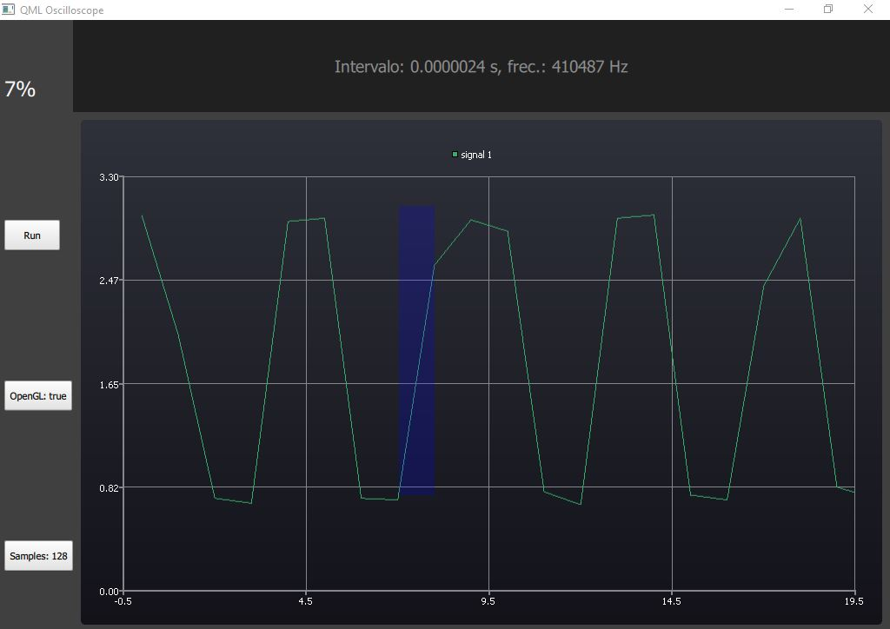

# QML Oscilloscope



This project is aimed at developing a homebrew single-channel oscilloscope capable of measuring signals with frequencies up to 100 KHz within a range of 0 to 3.3V.

## Frameworks

- Qt 5.8: Provides the graphical user interface for PC.
- Thonny: Facilitates signal capture and transmission from the Raspberry Pi Pico to the PC.

## Compatibility

The current version of the oscilloscope is compatible only with the Windows operating system.

## Features

- Single-channel oscilloscope for measuring electronic signals.
- User-friendly graphical interface developed using Qt.
- Captures signals from the Raspberry Pi Pico.
- Supports frequencies of up to 100 KHz.
- Measurement range from 0 to 3.3V.

## Installation

To install and run the oscilloscope on your Windows PC, follow these steps:

1. Clone this repository to your local machine.

   ```bash
   git clone https://github.com/your-username/qml-oscilloscope.git
   
2. Ensure you have Qt 5.8 installed on your system.
3. Install Thonny on your Raspberry Pi Pico.

## How to Use
1. Connect the Raspberry Pi Pico to your PC.
2. Open the Thonny IDE on your Raspberry Pi Pico.
3. Upload the necessary firmware to the Raspberry Pi Pico for signal transmission.
4. Launch the Qt-based application on your PC.
5. Configure the oscilloscope settings such as frequency range and voltage range.
6. Start capturing and visualizing signals on the oscilloscope.

## Contributing
We welcome contributions to enhance the functionality and compatibility of the oscilloscope. If you would like to contribute, please fork this repository, create a new branch, make your changes, and submit a pull request.

## License
This project is licensed under the MIT License.

## Contact
If you have any questions or suggestions regarding this project, please feel free to contact the development team at https://t.me/+EbFdxe7a9z5mNjJh
